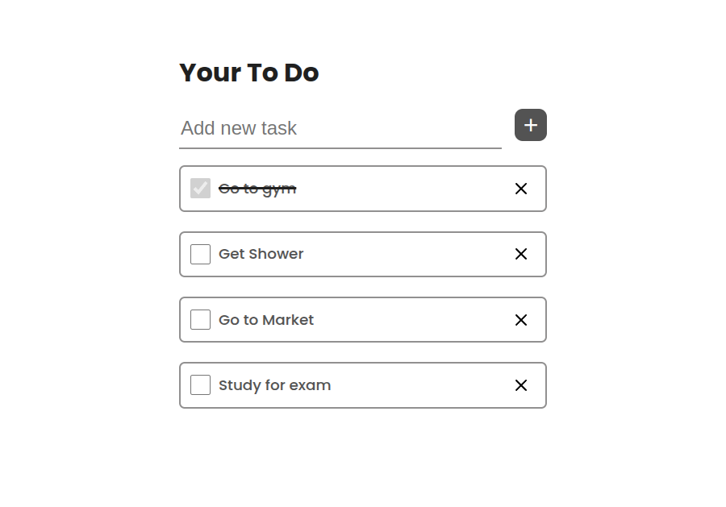

# Todo Application

Your productivity helper :)

## Running Application
run `dev` script to run application in development mode.

## Building Application
run `build:win`, `build:mac`, `build:win` scripts based on OS to build final application executable.
